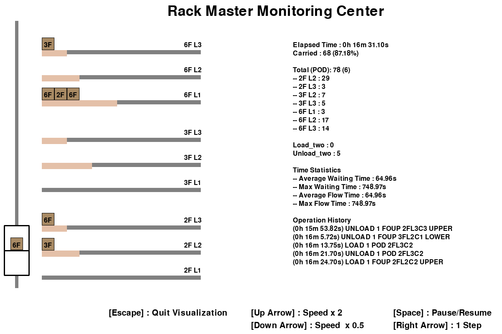

FAB Lifter Simulation Environment
====================================================

This repository includes an implementation of FAB lifter simulator.
A pygame-based simulator is provided to help users to monitor get key operational statistics, while providing real-time visualization of the environment.

## 1. Requirements
To use the repository, the followings must be installed:

- **Python**

- **[Gym][gymlink]**

- **[pygame][pygamelink]**


## 2. Installation
Before starting the installation, creating a separate virtual environment, e.g., Anaconda, is recommended.
Then, the rest of the installation process is straightforward.
For example, once you activate your Conda environment, just run
```
$ pip install -e .
```
to complete your installation.


## 3. Visualization
The simulator used to render the environment is built upon pygame library.

Adjustment of simulation speed is possible by pressing Up/Down Arrow keys, 
and pressing a Right Arrow key during pause will proceed the environment only 1 step.
To quit the visualization, just press Escape key, then the underlying simulator will run without any visualization.

[gymlink]: https://gym.openai.com/
[pygamelink]: https://github.com/pygame/pygame/
